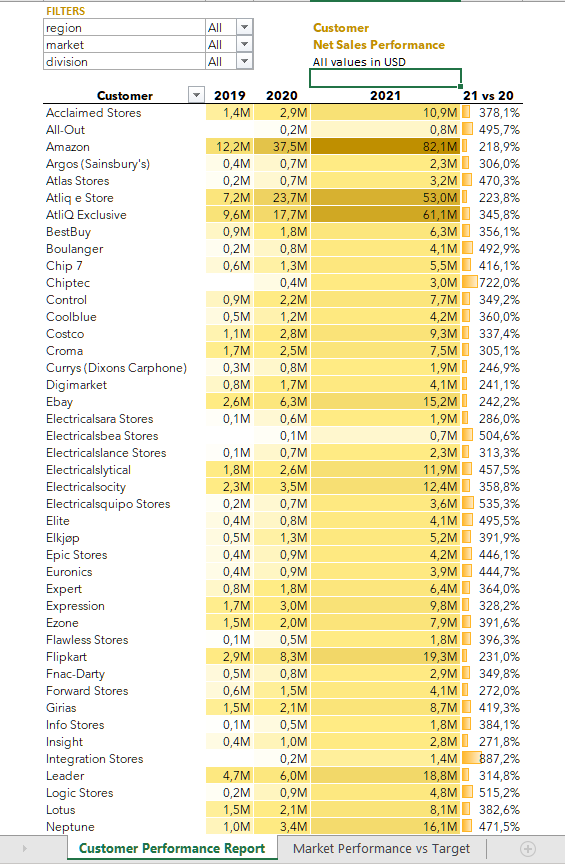

# Atliq Hardwares Sales Analysis

## Overview

This project involves the analysis of sales data for Atliq Hardwares, where I conducted a comprehensive study to gain insights into the company's sales performance. The analysis includes the creation of two sales reports and a detailed profit and loss statement categorized by months and quarters.

## Reports and Analysis Techniques

The sales reports were generated using Microsoft Excel, utilizing features such as pivot tables, power query, DAX (Data Analysis Expressions), and conditional formatting. These techniques allowed for a detailed exploration of sales data, providing valuable information for decision-making.

### Sales Reports

1. **Country and Yearly Breakdown:** The reports offer a breakdown of sales data based on countries and years, enabling a thorough understanding of regional performance and year-over-year growth.

2. **Customer-specific Analysis:** Additionally, the reports include a detailed analysis of sales data specific to individual clients of Atliq, aiding in identifying key customers and their contribution to overall sales.

### Profit and Loss Statement

The profit and loss statement provides a clear overview of the company's financial performance, categorized by months and quarters. This allows stakeholders to identify trends, assess profitability, and make informed financial decisions.

## Disclaimer

It's important to note that the data used for this analysis is proprietary to Atliq Hardwares, and due to confidentiality reasons, the actual Excel files with the raw data cannot be shared on this public GitHub repository.

## Project Purpose

This project was undertaken as part of my learning journey in a bootcamp organized by Codebasics and Atliq. The primary goal is to showcase the application of data analysis techniques in a real-world business context, using original sales data from Atliq Hardwares.

## Conclusion

Overall, this project aims to empower businesses with the necessary tools and insights to monitor, evaluate, and enhance their sales activities. By leveraging sales data analysis, businesses can unlock new opportunities, drive growth, and stay competitive in the dynamic market landscape.

## Screenshots

Customer Performance Report

Market Performance vs Target Report

P&L Report

